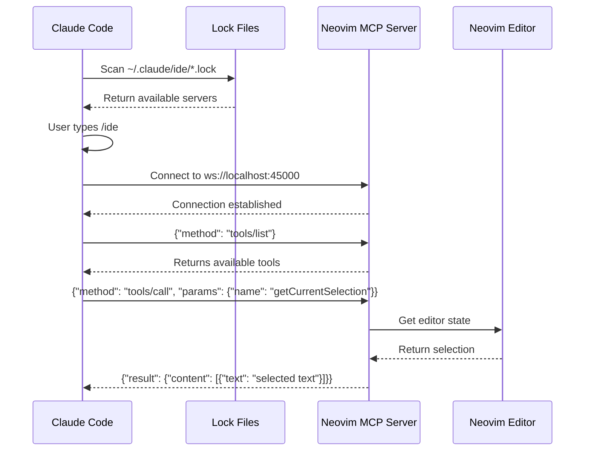

# How MCP Works with Neovim and Claude Code

## Overview

MCP (Model Context Protocol) is a standardized way for AI assistants like Claude to communicate with development tools. It uses WebSocket connections and JSON-RPC 2.0 for communication.

## The Two-Way Architecture

### 1. VS Code Extension (What we reverse-engineered)
```
Claude Code ----/ide----> VS Code Extension
                          (MCP Server on port 40145)
                          Creates lock file: ~/.claude/ide/<pid>.lock
```

### 2. Neovim Plugin (What we built)
```
Claude Code ----/ide----> Neovim Plugin
                          (MCP Server on port 45000)
                          Creates lock file: ~/.claude/ide/neovim_<pid>.lock
```

## How `/ide` Discovery Works

When you type `/ide` in Claude Code:

1. **Claude scans for lock files** in `~/.claude/ide/`
2. **Each lock file contains**:
   ```json
   {
     "pid": 584248,
     "port": 45000,
     "ideName": "Neovim",
     "transport": "ws",
     "authToken": "nvim-1234567-584248",
     "workspaceFolders": ["/home/user/project"]
   }
   ```

3. **Claude connects** to `ws://localhost:<port>` with the auth token
4. **Claude can then**:
   - List available tools
   - Call tools to interact with the editor

## Lock File Discovery Process

```bash
# Claude looks for lock files:
~/.claude/ide/
├── 367494.lock     # VS Code (PID-based filename)
├── 40145.lock      # VS Code (port-based, older format)  
└── neovim_584248.lock  # Neovim (prefixed with editor name)
```

## Communication Flow



## Testing the Connection

### 1. Start Neovim with MCP
```bash
# In terminal 1
cd /home/alejandro/VPS/CCIde/nvim-gemini-ccide
nvim -u init.lua

# Inside Neovim
:MCPStart 45000
```

### 2. Verify MCP is running
```bash
# In terminal 2
# Check lock file
cat ~/.claude/ide/neovim_*.lock

# Check port
ss -tlnp | grep 45000

# Test connection
python3 test_client.py
```

### 3. Use Claude Code
```bash
# In terminal 3
claude --debug

# Type in Claude
/ide
```

Claude should now show:
- "Connected to Neovim" (if our plugin is running)
- "Connected to Visual Studio Code" (if VS Code is running)

## What Claude Can Do Once Connected

Through MCP, Claude can:

1. **See your code**:
   - `getOpenEditors` - List all open buffers
   - `getCurrentSelection` - Get selected text
   
2. **Navigate**:
   - `openFile` - Open specific files
   - `getWorkspaceFolders` - Understand project structure

3. **Understand context**:
   - `getDiagnostics` - See errors/warnings
   - `checkDocumentDirty` - Know what needs saving

4. **Make changes**:
   - `saveDocument` - Save files
   - `executeCommand` - Run editor commands

## Multiple Editors Simultaneously

Claude can connect to multiple editors at once:

```bash
# Both can run at the same time:
VS Code:  ws://localhost:40145  (~/.claude/ide/367494.lock)
Neovim:   ws://localhost:45000  (~/.claude/ide/neovim_584248.lock)

# Claude will show both when you type /ide
```

## Troubleshooting

If `/ide` doesn't find Neovim:

1. **Check MCP is running**: `:MCPStatus` in Neovim
2. **Check lock file exists**: `ls ~/.claude/ide/neovim_*.lock`
3. **Check port is listening**: `ss -tlnp | grep 45000`
4. **Test manually**: `python3 test_client.py`
5. **Check Claude debug**: `claude --debug` shows connection attempts

## Security

- MCP servers only listen on localhost (not exposed to network)
- Each session has a unique auth token
- Lock files are user-readable only
- Connections require the auth token from the lock file